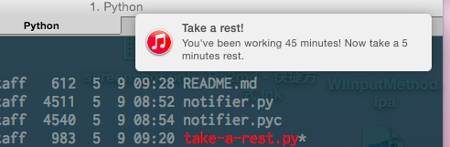

Take A Rest
===========

Sometimes you just need to take a rest.

### Requirments

* Python 2.7 / 3.4 with [schedule](https://github.com/dbader/schedule) installed

### Usage 

	usage: take-a-rest.py [-h] [-v] [-w WORK] [-r REST]

	A tiny reminder that will notify you when you need a rest

	optional arguments:
	  -h, --help            show this help message and exit
	  -v, --version         show program's version number and exit
	  -w WORK, --work WORK  working duration(in minutes)
	  -r REST, --rest REST  rest interval(in minutes)